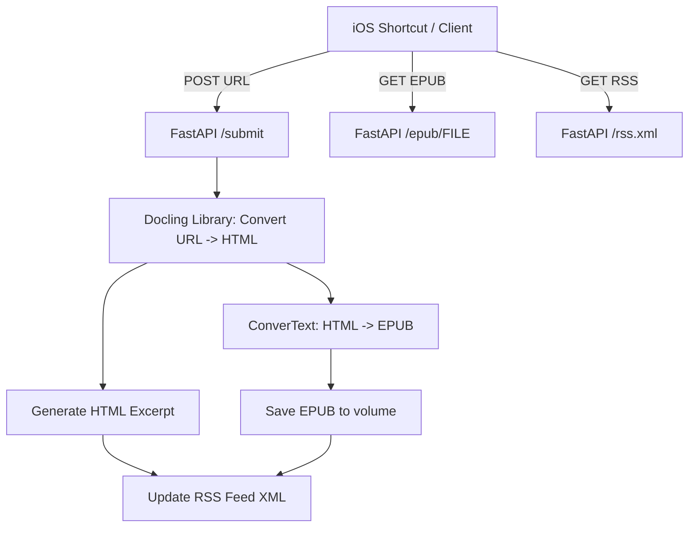
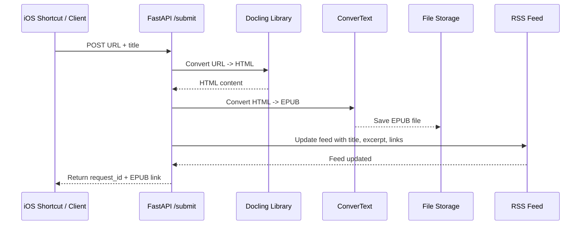

# Project README

# Docling → EPUB → RSS Web Service

This project is a lightweight FastAPI web application that:

- Accepts a URL to a PDF or web page via POST endpoint.
- Converts the content to HTML using Docling library.
- Converts HTML to EPUB using ConverText.
- Saves EPUB files to a mounted directory.
- Generates a single RSS feed containing processed documents, including title, HTML excerpt, link to original URL, and
  link to EPUB.

## Features

- HTML excerpt generation from Docling output, sanitized for RSS.
- Lightweight, single-process, self-hosted architecture.
- FastAPI endpoints for submitting URLs, fetching EPUB files, and retrieving RSS feed.

## Installation

1. Clone the repository.
1. Install dependencies:

```bash
uv sync
```

3. Ensure `convertext` CLI is installed and available in PATH.
1. Set environment variables if needed:

```bash
export APP_TOKEN=your_secret_token
```

5. Create directories for EPUBs and RSS feed (or use defaults):

```bash
mkdir -p data/epubs data/rss
```

## Usage

Run the FastAPI app:

```bash
uvicorn main:app --reload
```

### POST /submit

Submit a URL for processing:

```http
POST /submit
Headers:
  X-App-Token: your_secret_token
Body:
  {
    "url": "https://example.com/article.pdf",
    "title": "Example Article"
  }
```

Response:

```json
{
  "id": "unique_request_id",
  "epub": "/epub/unique_request_id.epub"
}
```

### GET /epub/{file}

Retrieve a processed EPUB file.

### GET /rss.xml

Retrieve the generated RSS feed.

## Flow Diagram



## Sequence Diagram



## Notes

- The RSS feed uses HTML excerpts wrapped in CDATA for proper rendering in feed readers.
- The system is designed for self-hosted usage with minimal external dependencies.
- iOS Shortcuts or any HTTP client can be used to submit URLs and retrieve RSS updates.

## License

MIT License
